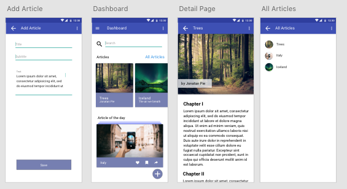

# fludder-blogish-todo Chingu "Fludder" Solo project

Prep work for a Tier-3 Chingu.io team programming cohort. Solo project. Uses Node/Express, Passport.js with local authentication using sessions and MongoDB/Mongoose, and Vanilla JS, EJS templates. Database hosted by MongoDB/Atlas; uploaded photos are saved to Cloudinary cloud via API and a link saved to my database. This was done to add data persistance rather than having photos periodically vanish due to how Heroku works. Frontend presentation is loosely based on photo provided. I "cheated" a bit by using an app "Bootstrap Studio" for some starter HTML/CSS. Chingu.io provided app specifications are below.

Currently working on reducing duplicate code in the EJS templates. This app could be more neatly rewritten using a REST API sending JSON and using JS on the frontend. I still may do that. This is my first time using EJS templates so it's likely a bit "busy" and "all over the place" in it's request handling ;-)

## Dates for 2021 first voyage

"The next Chingu Voyage starts on January 4th (2021). Completing your Solo Project during the Explorer Cohort and purchasing a Voyage or Job Ready gives you plenty of time to get to know Chingu better and prepare for Voyage 26 in January."

## Overview

This project helps you gain experience using authentication techniques to
protect your app and users against unauthorized access. Your objective in this
project is to build a mobile application that allows users to register, login,
and maintain personal notes.

## Instructions

General instructions for all Solo Projects are located in your Chingu Handbook.
For detailed requirements, please checkout the following.

Take whatever packages and backend frameworks of your choice.

### Mockup provided

### Requirements

_Structure_

- [ ] Backend: Design & create your backend application server
  - [ ] Set up your backend boilerplate (e.g. database URI)
  - [ ] Create the note schema
  - [ ] Create the backend routes (e.g. GET, POST)
- [ ] Frontend: Identify and create the main components of your frontend application
      (e.g. Header, Note input area, list of previously entered notes, dialog or area
      to update previously entered notes)

_Style_

- [ ] You may use any style you choose. However, it should be consistent (e.g.
      font, font size, color scheme, layout, etc.).
- [ ] Use the correct widget depending on the system
  - Cupertino Widgets - iOS Apple
  - Material Widgets - Android

_Functionality_

- Backend: Implement user authentication
  - [ ] Add a signup route to allow users to create an app account (e.g. user
        name & password) for themselves
  - [ ] Add a login route to allow users who have completed the signup process
        to login to the application
- Frontend: Implement the necessary functionality for each component. Users
  must be able to:
  - [ ] signup to create an app-specific account
  - [ ] login to use the app
  - [ ] post a new notes to the list of previously entered notes
  - [ ] modify previously added notes
  - [ ] delete previously entered notes
- Frontend: Miscellaneous functionality
  - [ ] Use the API exposed by the app Backend to deliver functionality to
        your users

_Other_

- [ ] Your repo needs to have a robust `README.md` (See [Keys to a Well-Written Readme](https://medium.com/chingu/keys-to-a-well-written-readme-55c53d34fe6d))
- [ ] Before submitting make sure that there are no errors in the developer console
- Anticipate and handle any edge cases
  - [ ] Does entering random data, such as a mix of alphbetic, numeric, and
        special characters in the search input result in an error?
  - [ ] What is displayed if the search location is not found?

**Extras (Not Required)**

- [ ] Add the ability for users to upload pictures (or even audio clips) to articles
- [ ] Use as FEW external packages and libraries as possible to reduce the
      number of dependencies.
- [ ] Write Unit and Widget Tests
- [ ] Use Accessibility techniques (i.e. a11ly) to improve your site for users
      with impairments (see [A11Y Project](https://a11yproject.com/))
- [ ] Add a `CONTRIBUTING.md` file with instructions on how to contribute to
      your project
- [ ] Implement service workers to improve performance by relying on cached
      data (see [Service Workers: An Introduction](https://developers.google.com/web/fundamentals/primers/service-workers))
- [ ] Create a Web Application and / or Desktop Application

  - [Flutter Web Support](https://flutter.dev/web)
  - [Flutter Desktop Support](https://flutter.dev/desktop)
